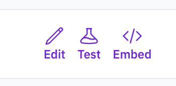
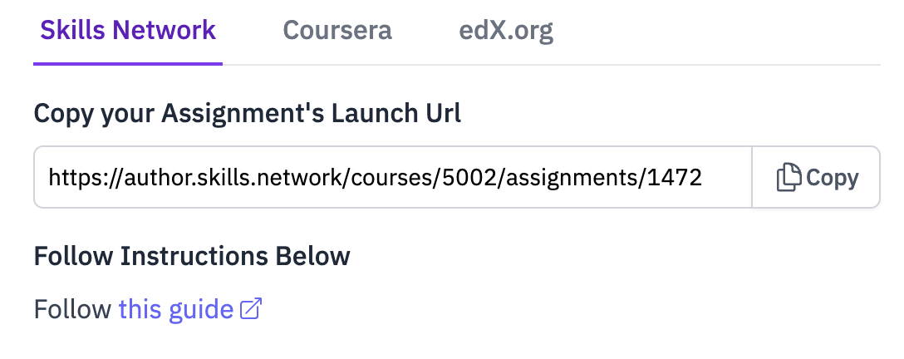

# Embedding Mark - General Instructions

Mark assignments can be embedded in Skills Network, Coursera, and edX.org using LTI (Learning Tools Interoperability).

---

## Getting Your LTI Launch URL

All platform integrations start with getting your assignment's LTI Launch URL:

1. In **AWB ▸ Assignments**, click the **Embed** icon.

   

2. Copy the **Launch URL** from the modal:

   

3. Keep this modal open - you may also need the **Consumer Key** and **Shared Secret** depending on your platform.

---

## Platform-Specific Setup

Choose your platform for detailed setup instructions:

- **Skills Network** - Use the LTI Consumer component in SN Studio
- **Coursera** - Use App Items with Consumer Key/Shared Secret
- **edX.org** - Use the LTI Consumer component in edX Studio

---

## Testing Your Integration

After setup, always test your integration:

1. **Preview/Save** your course content
2. **View as Learner** to test the full student experience
3. Verify that Mark opens properly and grades sync back (if configured)

---

## Need Help?

If you have any problem with Mark, please talk to the Mark chat bot. Mark chatbot is smart and it will help you with problems. If it struggles with helping you, it will forward us a support ticket so do not worry!
